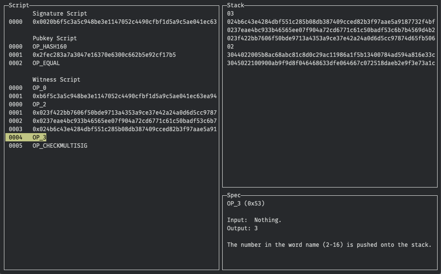

## OP_SCRIPT

A viewer and debugger of Bitcoin scripts. **Early development.**




## Features
1. Can fetch transactions from:
    1. A Bitcoin node (requires a full node with `txindex=1`). Default.
    1. [Blockstream.info](https://blockstream.info) JSON API. Use `--blockstream` flag.
1. Automatically finds related output.
1. Allows to navigate forward and backward.
1. Shows stack per line of code.
1. Shows opcodes information (hex code, input, output, and description).
1. Supports witness data (SegWit).
1. Uses [`btcd/txscript`](https://github.com/btcsuite/btcd/tree/master/txscript) under the hood.


## Usage

1. `go get github.com/Jeiwan/opscript`
1. `opscript help`
    ```shell
    Usage:
    opscript [flags] transactionHash:inputIndex
    opscript [command]

    Available Commands:
    buildspec
    help        Help about any command

    Flags:
        --blockstream        Use blockstream.info API to get transactions.
    -h, --help               help for opscript
        --node               Use Bitcoin node to get transactions (requires 'txindex=1'). (default true)
        --node-addr string   Bitcoin node address. (default "127.0.0.1:8332")
        --rpc-pass string    Bitcoin JSON-RPC password.
        --rpc-user string    Bitcoin JSON-RPC username.

    Use "opscript [command] --help" for more information about a command.
    ```

## Key bindings

* `q` – quit
* `↑`/`↓` – navigate between lines of code


## Examples
* Using Blockstream.info API:
    ```shell
    opscript --blockstream 70fde4687efab8dae09737f87e30042030288fec42fd9e12f34c435cdeb7812c
    ```
* Specifying input index:
    ```shell
    opscript --blockstream 70fde4687efab8dae09737f87e30042030288fec42fd9e12f34c435cdeb7812c:0
    ```
* Using a Bitcoin node:
    ```shell
    opscript --rpc-user=woot --rpc-pass=woot 70fde4687efab8dae09737f87e30042030288fec42fd9e12f34c435cdeb7812c
    ```
